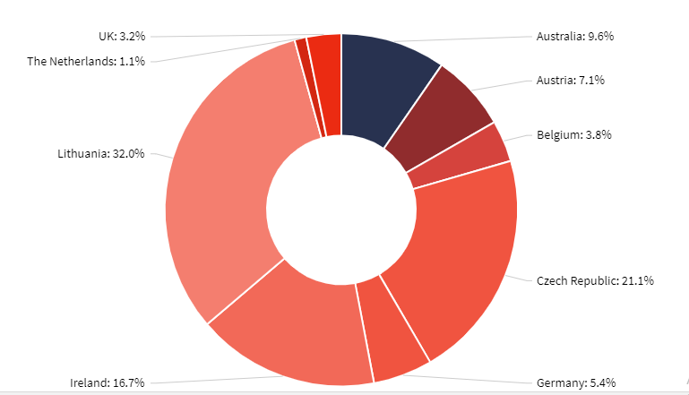

# Qliksense Nested Donut Chart Extension using amCharts.

## Introduction

This is qliksense nested donut chart extension I have created using [amCharts](https://www.amcharts.com/) javascript library. I have also add some custom settings so qlik user can customize and mess around to original amcharts API to have desirable custom effects.
 
Please rate & give feedback! If you want to contribute feel free to message me on github.

#### Chart Custom Settings
#### Path to custom settings: Appearance > Chart Custom Settings
- Change Theme : Using dropdown you can change theme of chart.
- Inner Radius (%) : Set Inner radius of hole. In terms percentance of radius of pie chart.  (default value = 40).

## Screenshots
### With one measure and Dataviz theme 

### With two measures and Frozen theme 

### With three measures and Moonrisekingdom theme 

### Settings

## Disclaimer
I'm in no way affiliated with amcharts.com. Their library is free to use for commercial purposes with the caveate that you must include the link to their website in the charts. 